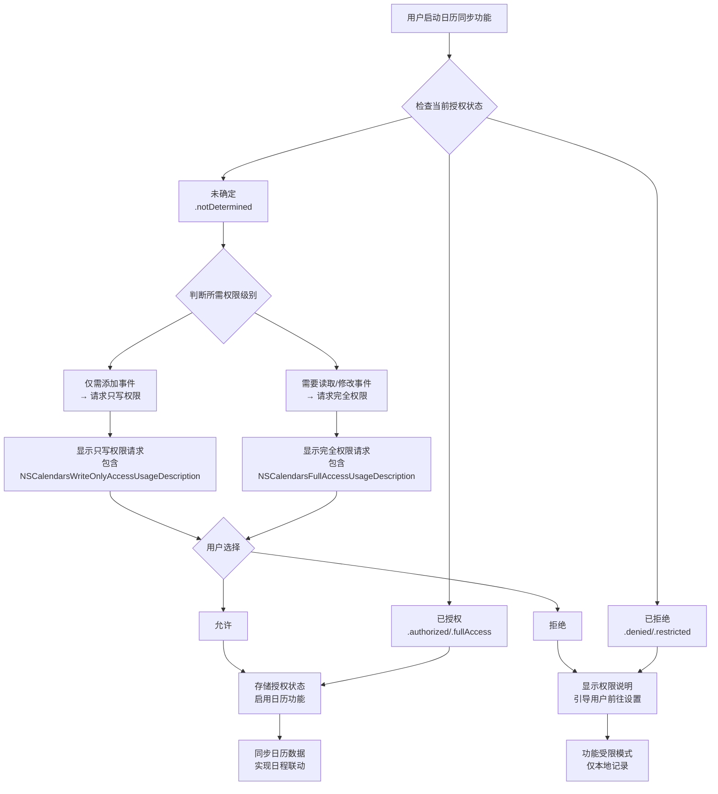

# MemoTime App 技术可行性验证报告补充：日历与健康模块评估

## 3. 日历模块技术评估

### 3.1 EventKit框架概述

EventKit是苹果提供的日历数据交互框架，支持iOS、iPadOS、macOS、watchOS和visionOS平台。该框架提供了：

1. **核心类型**：
   - `EKEventStore`：日历数据的主要接入点，用于请求访问权限、获取或保存数据
   - `EKEvent`：表示特定事件，包含标题、开始日期、结束日期、地点等属性
   - `EKCalendar`：表示日历集合，具有标题和颜色属性
   - `EKSource`：表示日历账户源，用于UI分组

2. **访问权限级别**（iOS 17+）：
   - **无访问权限**：可以使用EventKitUI或Siri Event Suggestions添加事件
   - **只写访问权限**：可以直接使用EventKit添加事件，无法读取现有事件
   - **完全访问权限**：可以获取、更改现有事件，访问现有日历，创建新日历

### 3.2 权限申请流程设计

#### 3.2.1 Info.plist配置

基于iOS 17+的最佳实践，需要配置不同的使用描述字符串：

```xml
<!-- iOS 17+ 完全访问权限 -->
<key>NSCalendarsFullAccessUsageDescription</key>
<string>MemoTime需要访问您的日历事件，以便同步日程与待办事项，提供日程联动功能</string>

<!-- iOS 17+ 只写访问权限 -->
<key>NSCalendarsWriteOnlyAccessUsageDescription</key>
<string>MemoTime需要将日程事件保存到您的日历中</string>

<!-- iOS 16及以下版本兼容 -->
<key>NSCalendarsUsageDescription</key>
<string>MemoTime需要访问您的日历事件，以便同步日程与待办事项</string>
```

#### 3.2.2 权限申请流程图



### 3.3 iCloud同步机制与数据一致性方案

#### 3.3.1 iCloud日历同步原理

1. **数据存储**：日历事件存储在用户的iCloud账户中
2. **同步机制**：通过CalDAV协议实现跨设备实时同步
3. **冲突解决**：系统自动处理冲突，采用"最后写入优先"策略

#### 3.3.2 跨平台数据一致性设计

**方案1：本地缓存与增量同步**
```swift
struct CalendarSyncManager {
    // 1. 本地缓存最近7天事件
    var localCache: [EKEvent] = []
    
    // 2. 记录上次同步时间戳
    var lastSyncTimestamp: Date = Date()
    
    // 3. 增量同步方法
    func incrementalSync(eventStore: EKEventStore) async throws {
        let predicate = eventStore.predicateForEvents(
            withStart: lastSyncTimestamp,
            end: Date(),
            calendars: nil
        )
        let newEvents = eventStore.events(matching: predicate)
        
        // 更新本地缓存
        localCache.append(contentsOf: newEvents)
        
        // 更新同步时间戳
        lastSyncTimestamp = Date()
    }
}
```

**方案2：事件标识符映射**
```swift
struct EventMapping {
    // MemoTime内部ID ↔ EventKit事件ID
    var memoTimeEventID: String
    var ekEventID: String
    
    // 同步状态
    var syncStatus: SyncStatus = .pending
    var lastModified: Date = Date()
}

enum SyncStatus {
    case pending, synced, conflicted, error
}
```

### 3.4 隐私保护实施方案

#### 3.4.1 基于"可选的受控云同步"模式的设计

**本地端到端加密方案**：
```swift
struct EncryptedCalendarEvent {
    // 加密的事件数据
    var encryptedData: Data
    
    // 使用的加密算法
    var encryptionAlgorithm: EncryptionAlgorithm = .aes256GCM
    
    // 密钥派生参数
    var keyDerivationParams: KeyDerivationParams
    
    // 本地元数据（未加密）
    var eventIdentifier: String
    var syncStatus: SyncStatus
}

enum EncryptionAlgorithm {
    case aes256GCM, chacha20Poly1305
}
```

**用户隐私控制界面设计**：
1. **权限级别选择**：
   - 选项A：仅本地使用（不请求日历权限）
   - 选项B：只写权限（仅添加事件到日历）
   - 选项C：完全访问（读取和修改现有事件）

2. **云同步开关**：
   - 默认关闭：所有数据本地加密存储
   - 用户开启：可选择同步到iCloud或第三方云服务

### 3.5 技术可行性评估

| 评估维度 | 可行性 | 说明 |
|---------|--------|------|
| **API调用** | ✅ 完全可行 | EventKit框架成熟稳定，iOS 8+全平台支持 |
| **权限管理** | ✅ 可行但有复杂度 | iOS 17+三级权限体系精细，需要版本兼容处理 |
| **数据同步** | ✅ 可行 | iCloud自动同步机制完善，冲突解决需设计 |
| **隐私保护** | ✅ 完全可行 | 本地加密+可选云同步模式符合用户要求 |
| **实现复杂度** | 中等 | 权限流程、同步机制、加密方案需系统设计 |
| **时间成本** | 2-3周 | 包括开发、测试和用户体验优化 |

## 4. 健康模块技术评估

### 4.1 HealthKit API数据访问分析

#### 4.1.1 数据访问范围与精度

HealthKit支持的健康数据类型包括：

1. **健身数据**：
   - 步数、距离、爬升高度
   - 活动能量（卡路里）
   - 锻炼时长和类型
   - 站立小时数

2. **生理指标**：
   - 心率（实时和静息）
   - 血氧饱和度
   - 血压
   - 体温
   - 呼吸频率

3. **健康记录**：
   - 睡眠分析（床上时间、睡眠时长）
   - 正念分钟数
   - 月经周期追踪
   - 用药记录

**数据精度评估**：
- **时间精度**：毫秒级时间戳
- **数值精度**：双精度浮点数，医学级准确性
- **数据源**：可区分Apple Watch、iPhone、第三方设备

#### 4.1.2 实时同步技术路径设计

**方案A：Observer Query（实时监控）**
```swift
class HealthDataMonitor {
    let healthStore = HKHealthStore()
    
    func startHeartRateMonitoring() {
        guard let heartRateType = HKObjectType.quantityType(forIdentifier: .heartRate) else {
            return
        }
        
        let query = HKObserverQuery(
            sampleType: heartRateType,
            predicate: nil
        ) { query, completionHandler, error in
            if let error = error {
                print("监测错误: \(error)")
                return
            }
            
            // 获取最新心率数据
            self.fetchLatestHeartRate()
            
            // 必须调用完成处理程序
            completionHandler()
        }
        
        healthStore.execute(query)
    }
    
    func fetchLatestHeartRate() {
        guard let heartRateType = HKQuantityType.quantityType(forIdentifier: .heartRate) else {
            return
        }
        
        let sortDescriptor = NSSortDescriptor(
            key: HKSampleSortIdentifierStartDate,
            ascending: false
        )
        
        let query = HKSampleQuery(
            sampleType: heartRateType,
            predicate: nil,
            limit: 1,
            sortDescriptors: [sortDescriptor]
        ) { query, samples, error in
            guard let samples = samples as? [HKQuantitySample], let sample = samples.first else {
                return
            }
            
            let heartRateUnit = HKUnit(from: "count/min")
            let heartRateValue = sample.quantity.doubleValue(for: heartRateUnit)
            
            // 更新MemoTime个人数据面板
            self.updateHealthDashboard(heartRate: heartRateValue)
        }
        
        healthStore.execute(query)
    }
}
```

**方案B：Anchored Object Query（增量同步）**
```swift
func startAnchoredQuery() {
    guard let stepType = HKObjectType.quantityType(forIdentifier: .stepCount) else {
        return
    }
    
    // 使用锚点跟踪上次同步位置
    var anchor: HKQueryAnchor? = loadAnchorFromKeychain()
    
    let query = HKAnchoredObjectQuery(
        type: stepType,
        predicate: nil,
        anchor: anchor,
        limit: HKObjectQueryNoLimit
    ) { query, newSamples, deletedSamples, newAnchor, error in
        if let error = error {
            print("锚点查询错误: \(error)")
            return
        }
        
        // 处理新数据
        if let newSamples = newSamples as? [HKQuantitySample] {
            self.processNewHealthData(samples: newSamples)
        }
        
        // 更新锚点
        self.saveAnchorToKeychain(anchor: newAnchor)
    }
    
    healthStore.execute(query)
}
```

### 4.2 隐私保护要求分析

#### 4.2.1 Info.plist配置要求

HealthKit强制要求提供详细的隐私使用说明：

```xml
<!-- 读取健康数据的权限说明 -->
<key>NSHealthShareUsageDescription</key>
<string>MemoTime需要读取您的健康数据（步数、心率、睡眠等），以便在个人数据面板中提供健康状态概览和趋势分析</string>

<!-- 写入健康数据的权限说明 -->
<key>NSHealthUpdateUsageDescription</key>
<string>MemoTime需要保存健康数据分析结果，以便为您提供个性化健康建议</string>

<!-- 临床记录数据访问要求（可选） -->
<key>NSHealthRequiredReadAuthorizationTypeIdentifiers</key>
<array>
    <string>HKClinicalTypeIdentifierAllergyRecord</string>
    <string>HKClinicalTypeIdentifierMedicationRecord</string>
    <string>HKClinicalTypeIdentifierConditionRecord</string>
</array>
```

#### 4.2.2 关键隐私限制

1. **授权粒度**：必须按数据类型单独请求读写权限
2. **权限状态保密**：应用无法获知用户是否拒绝了读取权限
3. **数据使用限制**：
   - 禁止用于广告或数据销售
   - 禁止未经明确同意共享数据
   - 必须提供透明的隐私政策

### 4.3 端到端加密方案设计

#### 4.3.1 本地加密存储架构

**数据加密流程**：
```swift
struct EncryptedHealthData {
    // 1. 用户主密钥派生
    let userMasterKey: Data = deriveMasterKey(
        password: userPassword,
        salt: deviceSalt
    )
    
    // 2. 数据类型特定密钥
    let dataTypeKey: Data = deriveDataTypeKey(
        masterKey: userMasterKey,
        dataType: "heartRate"
    )
    
    // 3. 加密健康数据
    func encryptHealthSample(sample: HKQuantitySample) throws -> EncryptedHealthSample {
        // 序列化健康数据
        let sampleData = try JSONEncoder().encode(sample)
        
        // AES-256-GCM加密
        let encryptedData = try AES.GCM.seal(
            sampleData,
            using: dataTypeKey
        )
        
        return EncryptedHealthSample(
            encryptedData: encryptedData,
            metadata: sample.metadata,
            syncFlag: false
        )
    }
    
    // 4. 本地存储
    func saveToLocalStorage(encryptedSample: EncryptedHealthSample) {
        let realm = try! Realm()
        try! realm.write {
            realm.add(encryptedSample)
        }
    }
}
```

#### 4.3.2 云同步安全机制

**可选云同步设计**：
```swift
class HealthDataSyncManager {
    var syncEnabled: Bool = false
    
    // 用户选择云服务提供商
    var cloudProvider: CloudProvider = .icloud
    
    // 端到端加密传输
    func syncToCloud(encryptedSamples: [EncryptedHealthSample]) async throws {
        guard syncEnabled else { return }
        
        // 1. 本地二次加密（信封加密）
        let envelopeEncryptedData = try envelopeEncryption(
            data: encryptedSamples,
            recipientPublicKey: cloudProvider.publicKey
        )
        
        // 2. 安全传输
        try await cloudProvider.upload(
            encryptedData: envelopeEncryptedData,
            metadata: generateSyncMetadata()
        )
        
        // 3. 更新本地同步状态
        updateLocalSyncStatus(samples: encryptedSamples)
    }
    
    // 用户可随时关闭云同步
    func toggleCloudSync(enabled: Bool) {
        syncEnabled = enabled
        
        if !enabled {
            // 清理云端的临时数据
            cleanupCloudData()
        }
    }
}
```

### 4.4 与MemoTime App集成方案

#### 4.4.1 个人数据面板集成设计

**健康数据展示模块**：
```swift
struct HealthDashboardView: View {
    @State private var healthMetrics: HealthMetrics = HealthMetrics()
    
    var body: some View {
        VStack(spacing: 16) {
            // 1. 健康概览卡片
            HealthOverviewCard(
                steps: healthMetrics.dailySteps,
                heartRate: healthMetrics.currentHeartRate,
                sleepHours: healthMetrics.lastNightSleep
            )
            
            // 2. 趋势分析图表
            HealthTrendChart(
                data: healthMetrics.weeklyTrend,
                metrics: [.steps, .heartRate, .sleep]
            )
            
            // 3. 健康建议模块
            HealthRecommendationView(
                basedOn: healthMetrics,
                timeContext: .morning
            )
        }
        .onAppear {
            loadHealthData()
        }
    }
    
    func loadHealthData() {
        // 从本地加密存储加载数据
        let decryptedData = HealthDataManager.shared.loadDecryptedData()
        healthMetrics.update(with: decryptedData)
    }
}
```

#### 4.4.2 实时健康监控集成

**后台数据采集**：
```swift
class BackgroundHealthMonitor {
    func configureBackgroundDelivery() {
        guard let stepType = HKObjectType.quantityType(forIdentifier: .stepCount),
              let heartRateType = HKObjectType.quantityType(forIdentifier: .heartRate) else {
            return
        }
        
        // 设置步数数据后台更新
        healthStore.enableBackgroundDelivery(
            for: stepType,
            frequency: .hourly
        ) { success, error in
            if success {
                print("步数后台更新已启用")
            }
        }
        
        // 设置心率数据后台更新
        healthStore.enableBackgroundDelivery(
            for: heartRateType,
            frequency: .immediate
        ) { success, error in
            if success {
                print("心率后台更新已启用")
            }
        }
    }
}
```

### 4.5 技术可行性评估

| 评估维度 | 可行性 | 说明 |
|---------|--------|------|
| **数据访问范围** | ✅ 完全可行 | HealthKit覆盖所有需要的健身和健康数据类型 |
| **实时同步能力** | ✅ 可行 | Observer Query支持实时数据监控和更新 |
| **隐私合规性** | ✅ 可行但需注意 | 需要严格遵守苹果健康数据使用规定 |
| **加密方案** | ✅ 完全可行 | AES-256-GCM满足端到端加密要求 |
| **集成复杂度** | 中等偏高 | 健康数据模型复杂，需处理多种数据类型 |
| **用户授权体验** | 复杂 | 健康数据权限流程较长，需要清晰引导 |
| **时间成本** | 3-4周 | 包括数据采集、加密、同步和界面开发 |

## 5. 总体评估与实施建议

### 5.1 技术风险分析

**日历模块主要风险**：
1. **版本兼容性**：iOS 17+的三级权限体系与旧版本差异大
2. **数据冲突**：多设备同步时的冲突解决逻辑复杂
3. **用户授权**：日历权限敏感，用户可能拒绝授权

**健康模块主要风险**：
1. **隐私合规**：健康数据使用受严格监管
2. **数据质量**：不同设备采集的数据精度不一
3. **后台限制**：iOS对后台数据采集有严格限制

### 5.2 实施优先级建议

基于评估结果，建议按以下顺序实施：

1. **第一阶段（日历模块）**：2-3周
   - 实现EventKit基础集成
   - 完成权限申请流程
   - 建立本地缓存机制

2. **第二阶段（健康模块核心）**：2-3周
   - 实现HealthKit数据读取
   - 建立本地加密存储
   - 开发个人数据面板基础

3. **第三阶段（高级功能）**：2-3周
   - 实现实时健康监控
   - 添加云同步选项
   - 优化用户体验

### 5.3 后续验证建议

1. **原型验证**：
   - 开发最小可行产品（MVP）验证技术方案
   - 测试跨版本兼容性
   - 验证数据加密和解密性能

2. **用户测试**：
   - 权限申请流程的用户接受度
   - 健康数据展示的清晰度
   - 同步功能的使用体验

3. **合规性审查**：
   - 隐私政策审查
   - 数据安全评估
   - 苹果App Store审核准备

---

**评估完成时间**：2026年2月25日  
**评估状态**：日历和健康模块技术评估完成  
**后续行动**：提交验证报告，开始财务模块和AI接口的技术评估